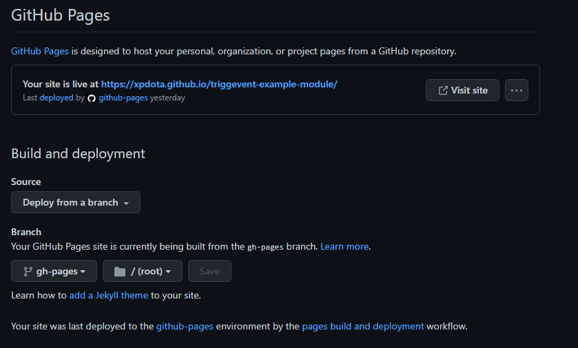
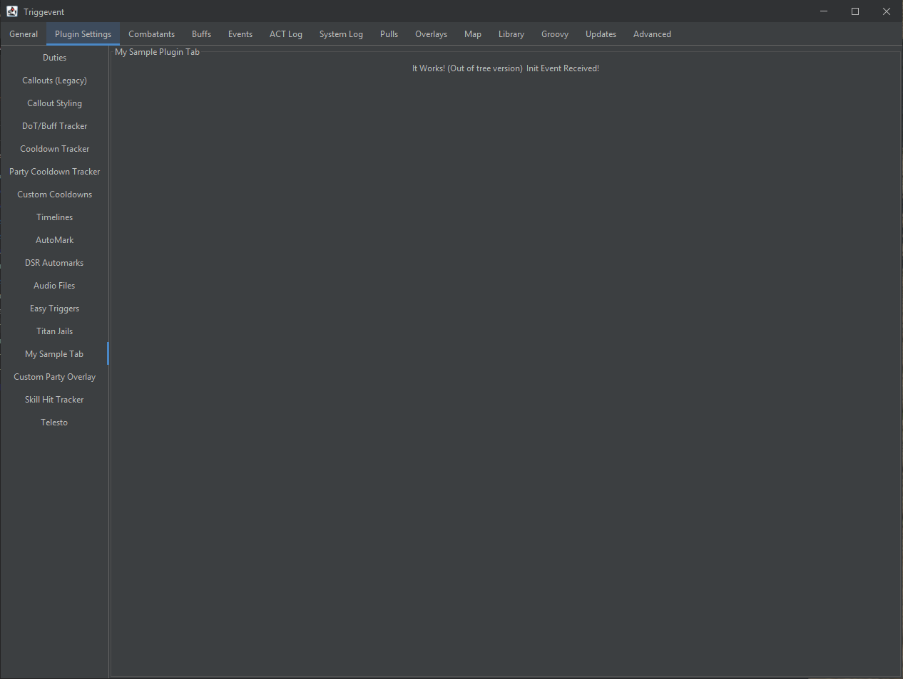
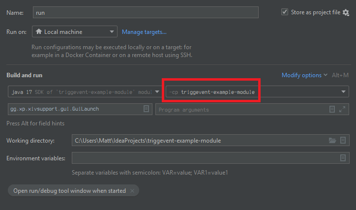

# Example Addon for [Triggevent](https://github.com/xpdota/event-trigger/)

This project is an example of how to make a standalone addon for Triggevent.

It includes all necessary build scripts and Github workflows to publish it.

To create and publish your own module, make your own fork or copy of this project, and do the following:

1. Clone or copy this project. It is set up as a Github template, so you can do so using the "Use this template" button. This will make a copy under a new name, without copying unnecessary git history.
2. In the pom.xml, change the artifact ID to a good and unique name for your project. You may want to add your nickname to make sure it's unique (e.g. 'johns-ucob-triggers').
3. Also change the group ID to something that reflects the ownership of the project (it does not need to be a real website, just enough to figure out who it belongs to).
4. Modify INFO.json accordingly.
    - name: Human-readable name
    - dir_name: Install subdirectory. First character must be a letter, everything after that should be alphanumeric, -, or _.
    - icon_url: An image. Will be displayed at 100x100px (before accounting for hi-DPI), so it should be a square.
    - webpage_url: A link to the website for the addon
    - url_pattern: The template used to download files (including the manifest). %s will be replaced with the file name.
5. Check out the main Triggevent sources, and do one of the following:
    - Do a `mvn clean install` of triggevent so that the build JARs are available in your local maven repository.
    - In IntelliJ, use File -> New -> "Module from Existing Sources..." and add the Triggevent sources as a module.
      This is the preferred option, as it allows you to explore and edit the real Triggevent sources as if they were
      part of your own project.
      If you do this, you may wish to hide Triggevent's git root in File -> Settings -> Version Control -> Directory 
      Mappings by changing the directory's VCS to 'none'.
      It has been reported that sometimes, IntelliJ will mark the various submodules as 'ignored'. To fix this, select all
      of the ignored modules in the maven panel (using shift-click or ctrl-click), then right click and 'Unignore Projects'.

6. In your Github project under Settings -> Actions -> General, ensure that Github actions are allowed.
7. After you commit and push once, make sure the Github Action workflow was successful.
8. In your Github project under Settings -> Pages, configure it as such:

If all of this worked, you should be able to reach your manifest file 
at `https://$(username).github.io/$(project name)/$(git branch)/manifest`
e.g. [https://xpdota.github.io/triggevent-example-module/master/manifest](https://xpdota.github.io/triggevent-example-module/master/manifest),
and your INFO file at `https://$(username).github.io/$(project name)/$(git branch)/INFO` e.g. [https://xpdota.github.io/triggevent-example-module/master/INFO](https://xpdota.github.io/triggevent-example-module/master/INFO).

The manifest file is simply a mapping of file hashes to files. The INFO file is what you would actually put in
the addon management screen to install the addon.

You should only include your own code and dependencies which are not already included in the base Triggevent.
Everything must be in JARs.

To install the addon, do the following in Triggevent (must be a proper installation, not IDE):

1. Navigate to Plugin Settings > Manage Addons
2. Click "Add From URL" and enter your INFO url (e.g. `https://xpdota.github.io/triggevent-example-module/master/INFO`)
3. Go to Updates > Check for Updates and Restart

For example, if you were to add this addon (`https://xpdota.github.io/triggevent-example-module/master/INFO`), and
run the updater, you would see a tab like this:

The JAR file is placed in `addon/test-addon` (relative to the install dir). 

## Testing/Debugging your Addon Before Publishing

This project comes with an IntelliJ run profile, simply called 'run', which should launch
Triggevent with your addon loaded.

Note that this profile may break due to renaming the module - if it doesn't work at all, or works
but doesn't load your addon, edit the run profile and change the module classpath to your module. 
Do this, but with the name of your module instead of the example:

## Maven Information

By default, your project uses the top-level triggevent pom as its parent. This is not required, so feel free to remove it
if needed. However, it helps ensure dependency versions are in sync, and reduces boilerplate.